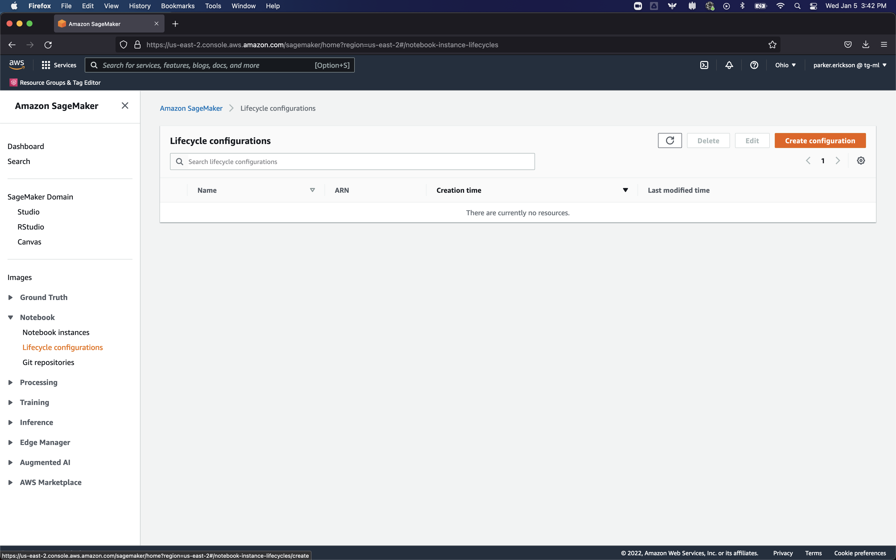
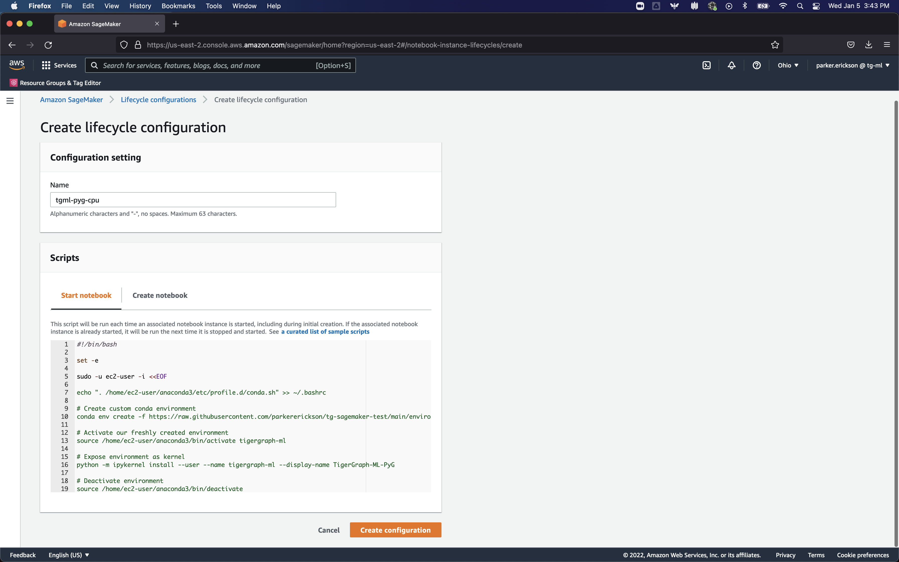
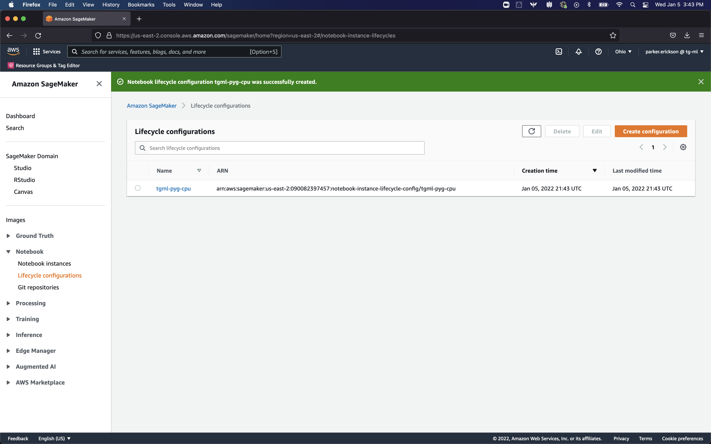
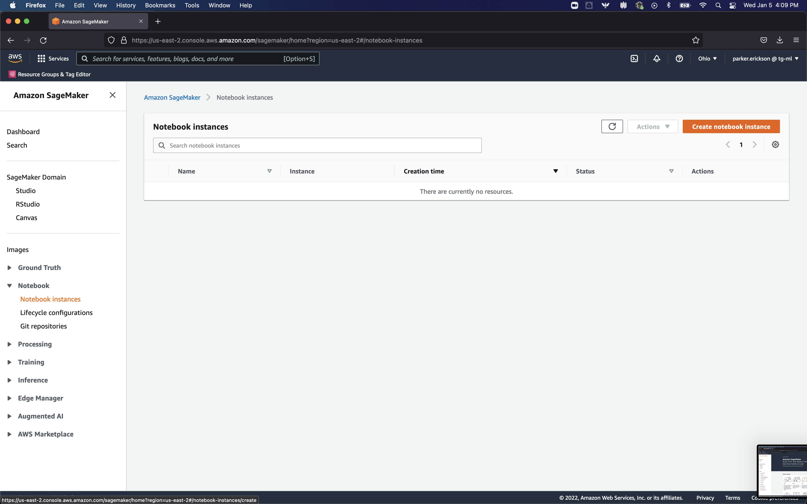
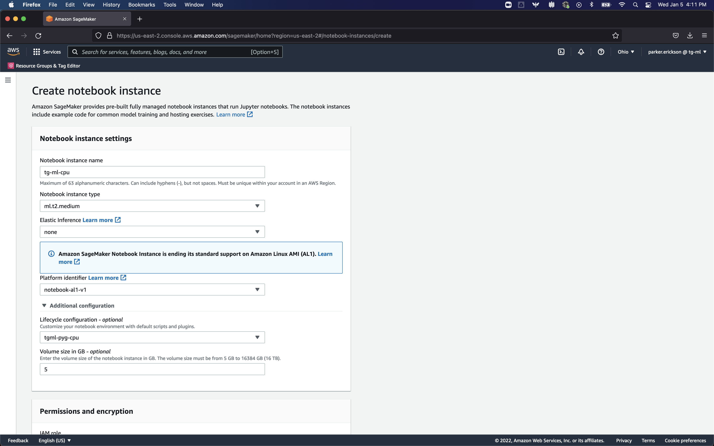
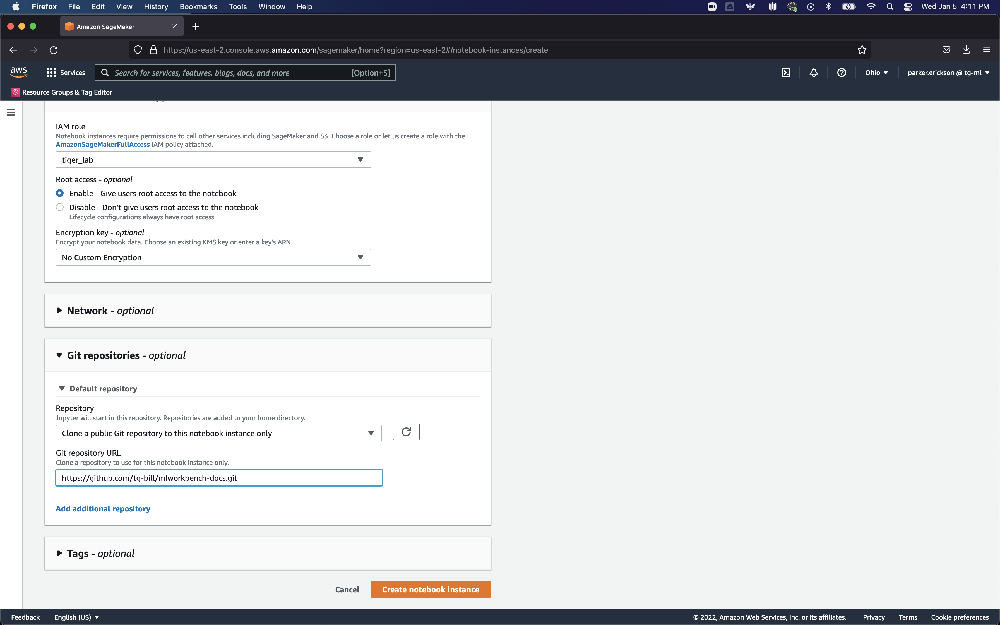
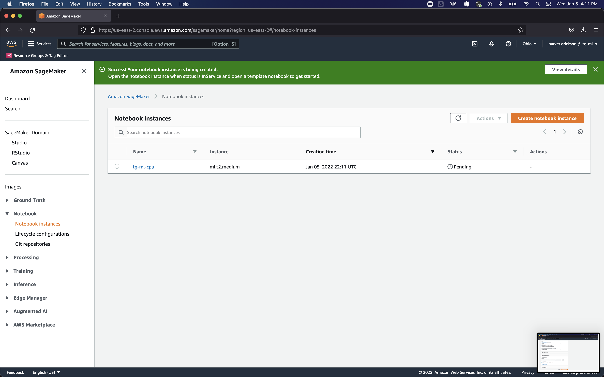
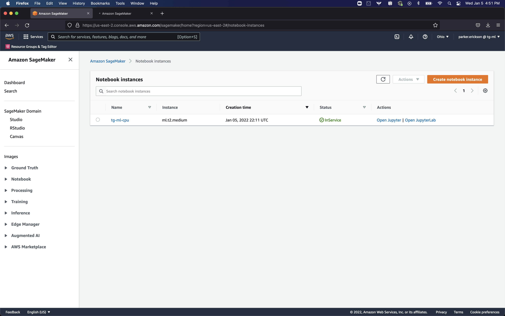
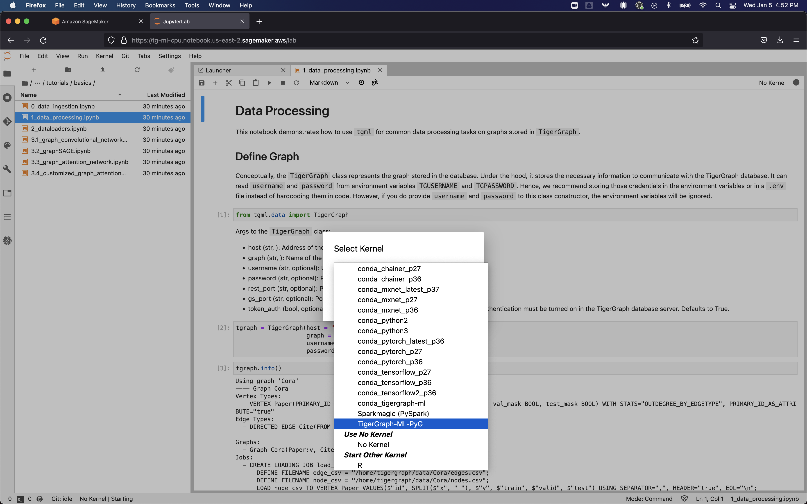

# Graph Machine Learning with TigerGraph and AWS

## Setup TigerGraph Database
### Install TigerGraph
As we are utilizing SageMaker, we also hosted our TigerGraph database on a Amazon EC2 m4.4xlarge instance. You can host your database on any sufficiently powerful, publicly accessible compute instance however. Once the instance was provisioned, ssh into the instance, and follow the TigerGraph installation instructions found here: [https://docs.tigergraph.com/tigergraph-server/current/installation/install](https://docs.tigergraph.com/tigergraph-server/current/installation/install).

### Install Graph Data Processing Service
In addition to the TigerGraph database server, we need to install an additional component called the Graph Data Processing Service, or GDPS. This will facilitate the graph sampling and other functionality needed to extract data from the graph for the model training process. To install the GDPS, follow the steps [here](https://github.com/TigerGraph-DevLabs/GDPS) in the home directory of the user where TigerGraph is installed.


## Setup SageMaker
### Create Lifecycle Configuration
The Lifecycle configuration defines commands that are run when the notebook instance is started. In this case, we will be installing the PyTorch Geometric and other TigerGraph dependencies. 

#### GPU Configuration
If you want a GPU instance to run your notebook, you need to edit the ```start_notebook.sh``` script to install the right dependencies. By changing the ```conda env create``` command to utilize the ```environment-gpu.yml``` file, instead of the ```environment-cpu.yml``` file. The resulting script is shown below.
```sh
#!/bin/bash

set -e

sudo -u ec2-user -i <<EOF

echo ". /home/ec2-user/anaconda3/etc/profile.d/conda.sh" >> ~/.bashrc

# Create custom conda environment
conda env create -f https://raw.githubusercontent.com/parkererickson/tg-sagemaker-test/main/environment-gpu.yml

# Activate our freshly created environment
source /home/ec2-user/anaconda3/bin/activate tigergraph-ml

# Expose environment as kernel
python -m ipykernel install --user --name tigergraph-ml --display-name TigerGraph-ML-PyG

# Deactivate environment
source /home/ec2-user/anaconda3/bin/deactivate

EOF
```
#### CPU Configuration
For the CPU  instance, you can directly use the ```start_notebook.sh``` script. By default, it uses the ```environment-cpu.yml``` file.

#### Add Script to Lifecycle Configuration (GUI Version)
Once you have copied the configuration script, we can create a new Lifecycle configuration using the SageMaker web UI.


From the SageMaker Console homepage, click the **Lifecycle configurations** tab under the **Notebook** tab. This will bring you to a page like this:


Click the **Create configuration** button to create a new lifecycle configuration, which will bring you to a page like this:


Enter a name for the configuration (I named mine `tgml-pyg-cpu`). Then, copy the script from `start_notebook.sh` (and edit it to use the GPU version if desired), and paste it into the **Start notebook** section of the **Scripts** tab. Then, click the **Create configuration** button to create the configuration. If all goes right, you should see something like this:



#### Add Script to Lifecycle Configuration (CLI Version)
Once you have copied the configuration script, we can create a new Lifecycle configuration using the SageMaker CLI. If you have the AWS CLI installed and configured, you can use the following command to create a new lifecycle configuration:
```sh
aws sagemaker create-notebook-instance-lifecycle-config --notebook-instance-lifecycle-config-name tgml-pyg-cpu --on-start Content=$((cat start_notebook.sh|| echo "")| base64)
```
Where `tgml-pyg-cpu` is the name of the Lifecycle Configuration, and `start_notebook.sh` is the script found in the home directory of this repo.

**Note:** You will have to edit the script to use the GPU version if you want to use a GPU instance.

### Create Notebook
#### GUI Version

From the SageMaker Console homepage, click the **Notebook instances** button underneath the **Notebook** tab. This will bring you to a page like this:


Click the **Create notebook** button to create a new notebook instance, which will bring you to a page like this:

##### Select the notebook instance type
Once on the notebook instance configuration page, you can select the notebook instance type. The default is `ml.t2.medium`. Refer to AWS documentation for more information. You also name your instance (I named mine `tgml-pyg-cpu`) here.

##### Add Lifecycle Configuration to Notebook
Under the **Additional configuration** tab, select the **Lifecycle configuration** you created earlier.

##### Add Tutorial GitHub Repo
If you want to add the `tgml` tutorial repository (or other Git repositories), scroll down to the **Git repositories** tab and add the link to repository. The tutorial repository is `https://github.com/tg-bill/mlworkbench-docs.git`.



Once that is completed, click the **Create notebook instance** button to create the notebook instance. You should see something like this:


#### CLI Version
To create a notebook instance using the SageMaker CLI, you can use the following command:
```sh
aws sagemaker create-notebook-instance --notebook-instance-name tgml-pyg-cpu-cli --instance-type ml.t2.medium --lifecycle-config-name tgml-pyg-cpu --default-code-repository https://github.com/tg-bill/mlworkbench-docs.git --role-arn YOUR_ROLE_ARN_HERE
```
Replacing `YOUR_ROLE_ARN_HERE` with the ARN of the SageMaker role you can find in the AWS IAM console.

## Train a Model
Once you have created a notebook instance, you can train a model using the notebook. From the **Notebook instances** page, click on the **JupyterLab** link to open the notebook.



This will take you to the JupyterLab page, where you can browse through the notebooks included in the repository we included. Once you find the notebook you want to run, a box will appear to select the conda environment to run the notebook in. Select the `TigerGraph-ML-PyG` environment.



Once you have selected the environment, you can run the notebook. Be sure to change the connection details to your own database.
